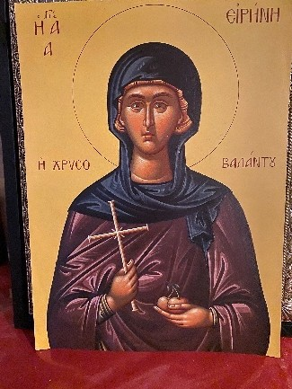
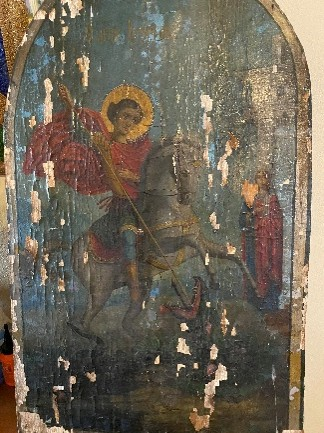
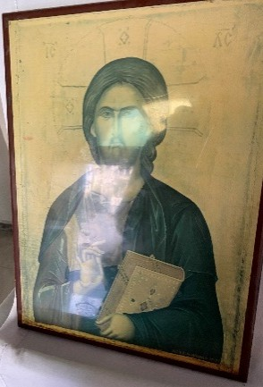
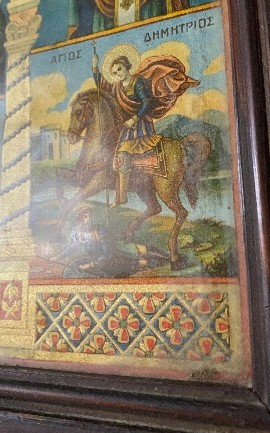
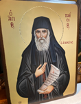
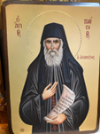
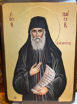
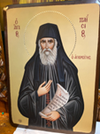
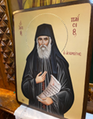

# ICONSAINT (ICONographic SAINT Recognition Dataset)
The data collected consists of church frescoes and portable icons of Saints, which can be found both in Christian Orthodox Churches and in the homes of believers, in the area of the Municipality of Pangaio in the Prefecture of Kavala in northern Greece. The captured icons are of various conditions, from very well preserved (Figure 1(a)) to partially damaged (Figure 1(b)). A dataset containing both well-preserved and dam-aged icons is invaluable for developing robust and reliable AI models that can recog-nize and interpret sacred imagery across real-world conditions.
Usually, icons found in churches or private collections vary in age and condition. Therefore, the proposed dataset aims to reflect real-world variability as well as the historical reality. Moreover, training on diverse inputs would improve the generaliza-tion ability of models and enhance their robustness to noise, e.g., missing icon parts, discolorations, etc. Note that damaged icons are essential for digital restoration tasks as well as towards adapting easily to related tasks such as predicting missing faces, identifying Saints based on partial features, or attributing icons to specific schools, art-ists or regions across time periods. 
All icons were photographed by following a specific protocol. Each icon was pho-tographed from a distance so that only the theme of the icon appears within the image. In cases where this was not possible, the image was taken so that the theme of the hagiography would appear as clear as possible. The difficulties in photographing the icon alone stemmed from lighting conditions and reflections on the protective glass covering the icons in most cases (Figure 1(c)), as well as the icons’ placement in inac-cessible locations or at significant heights (Figure 1(d)), especially in churches, and in some cases, their large size.
Each icon was photographed from five different angles:
-	Frontal angle (0°),
-	Right angle (~60°),
-	Left angle (~-60°), 
-	Intermediate angle between frontal and right (~30°),
-	Intermediate angle between frontal and left (~-30°).
  
The latter is towards creating a multi-angle dataset to help models recognize iconographic features regardless of perspective, thus improving their performance in real-world scenarios. Moreover, it is due to technical reasons, since, as already men-tioned, icons are often displayed behind glass, i.e., to avoid reflections.  
An example of the followed protocol of five different angles/perspectives is illus-trated in Figure 2.
<p align="center">
  
  
  
  
</p>
<p align="center">
  <em>Figure 1. Indicative images from the dataset, depicting the grading of the icons' quality: (a) very well preserved; (b) partially damaged; (c) with strong reflections; (d) poorly placed.</em>
</p>

<p align="center">
  
  
  
  
  

</p>
<p align="center">
  <em>Figure 2. Indicative set of images from the dataset, depicting Saint Paisios from five different per-spectives: (a) left angle; (b) intermediate frontal-left angle; (c) frontal angle; (d) intermediate frontal-right angle; (e) right angle.</em>
</p>

The final ICONSAINT dataset is a compilation of 546 different Christian Ortho-dox icons, each one photographed from five different angles, resulting in a total of 2730 images of 123 different Saints or religious events. The list of the number of images per Saint/event is included in Table 1. As it can be observed from Table 1, our final da-taset of 123 classes is an imbalanced dataset, since the number of images for each class is variable, ranging from 495 to 5. This is due to the fact that some Saints are most popular and are depicted in every Church, or are easier to find, while others are rare. 
All images were taken using an iPhone 11 with a dual 12MP camera with ul-tra-wide and wide-angle lenses, the apertures of which were f/2.4 and f/1.8, respec-tively, with the smart HDR function, thus allowing for high-definition and high-quality images to be captured.

If you use this dataset, please cite it as follows:

```bibtex
@journal{iconsaint2026,
  title     = {Computer Vision in Spiritual Seeing: Recognition of Christian Saints in Orthodox Iconography},
  author    = {I. I. Sidiropoulos, K. D. Apostolidis, E. Vrochidou, G. A. Papakostas},
  journal = {Information},
  year    = {2026},
  volume  = {#},
  number  = {#},
  pages   = {#},
  doi    = {#},
  URL = {#},

}
